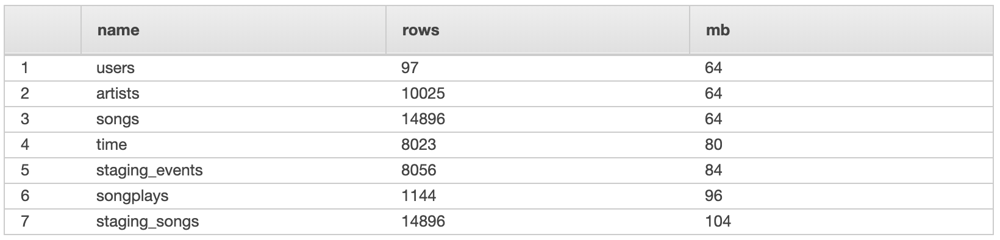

# Project: Data Warehousing with AWS

The purpose of this project is to create an ETL pipline that transfers data from two types of JSON log files stored in directory trees into an SQL database. The source data is song and user activity logs from a simulated music streaming app, Sparkify. The firm intends to move to the cloud, in this case Amazon Web Services (AWS). The data is stored in S3 buckets and will be loaded into staging tables on Redshift. After loading the data into staging tables, the data will be transformed into a star schema that is suitable for their queries.


---

## Data Files

The two sets of logs are located in S3 buckets.

_S3 location_:
```python
s3://udacity-dend/song_data
```
_S3 location_:
```python
s3://udacity-dend/log_data
```

Additionally, there is a JSON path file to assist in the `COPY` loading of the event JSON data.

_Log data JSON path_:
```python
s3://udacity-dend/log_json_path.json
```
### _Song Dataset_

The song data is stored in directory trees based on the first three letters of each song's track ID. 

_Example file structure_:
```javascript
song_data/A/A/C/TRAACCG128F92E8A55.json
```

### _Log Dataset_

The log data contains simlated event data for the music streaming app.

_Example file structure_:
```javascript
log_data/2018/11/2018-11-01-events.json
log_data/2018/11/2018-11-02-events.json
```

---

## Database Schema

### Staging Tables

The staging tables are created by reading in the JSON files using Redshift's `COPY` command which utilizes parallel loading of multiple files. The parallel loading allows the data to be loaded much faster than iterative `INSERT`. The table names are the same as those in the JSON files or as specified in the JSON path file.


### Final Schema

The final table schema of the Redshift database will be created using a **_star schema_**. Although the schema is slightly denormalized with some duplicate data fields between tables, it will optimize the song play queries that Sparkify would like to run.  Additionally, since the schema will be in a Redshift cluster there is some Redshift specific optimization that will speed up queries at the expense of upfront loading time and storage size.

The optimizations chosen:
- Set `start_time` as a `sortkey` to shorten the loading of time series data.
- Set `artist_id` as a `distkey` to distribute the data by artist making artist popularity or "also by this artist" type recommendations easily examinable.


    
### _Table Contents_

Table sizes were examined before and after optimization using the SQL command in the Redshift console.

```SQL
SELECT "table" as name, tbl_rows as rows, size as MB 
FROM SVV_TABLE_INFO
ORDER BY MB
```

Nieve Loading (Redshift chooses):




Redshift Optimized Loading:


---

## Files
<table>
  <tr>
    <th>File</th>
    <th>Description</th> 
  </tr>
  <tr>
    <td>images/</td>
    <td>Folder that contains any images used in more robust files, like README or ipynb.</td> 
  </tr>
  <tr>
    <td>create_tables.py</td>
    <td>Python script that deletes and recreates the database as outlined in sql_queries.py</td> 
  </tr>
  <tr>
    <td>dwh.cfg</td>
    <td>Configuration file that contains S3 locations, IAM and CLUSTER credentials, etc.</td> 
  </tr>
  <tr>
    <td>etl.py</td>
    <td>Python script that calls SQL queries to perform ETL operations.</td> 
  </tr>
  <tr>
    <td>README.md</td>
    <td>This file. Contains README for contents and usage.</td> 
  </tr>
  <tr>
    <td>sql_queries.py</td>
    <td>Python script that contains the SQL queries that create the schema, load files, and transforms data.</td> 
  </tr>
</table>

---

## Usage
<b>Requirements</b>:
- Amazon Redshift cluster
- IAM role with:
    + Redshift read/write permission
    + S3 read permission

<b>Usage</b>:
- Add cluster and IAM role information into `dwh.cfg`.
- Run `python create_tables.py` to create the tables in the database.
- Run `python etl.py` to load the data into the database tables.
    + Uses `COPY` to load the JSON files into staging tables.
    + Transforms data from staging tables into star schema.
