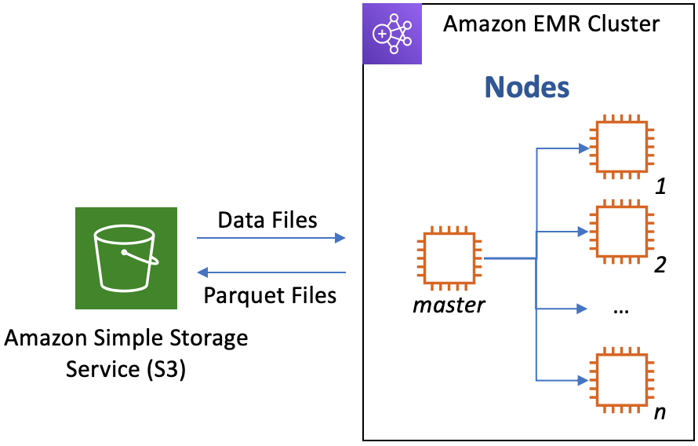
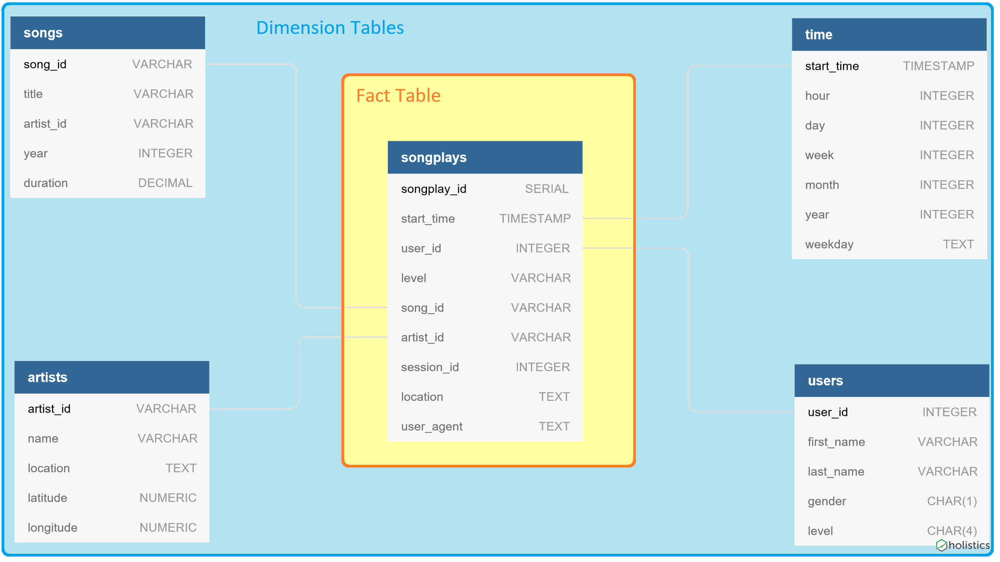

# Project: Data Lakes with AWS

The purpose of this project is to create an ETL pipline that transforms data from two types of JSON log files stored in directory trees into Spark DataFrames instead of tables following a database schema. The source data is song and user activity logs from a simulated music streaming app, Sparkify. The firm intends to move to a data lake, in this case Amazon Web Services (AWS). The data is stored in an S3 bucket, will be loaded into Spark DataFrames, and tranformed into the schema DataFrame tables. After loading the data into tables, the data will be stored as parquet files for faster, preprocessed loading.



---

## Data Files

The two sets of logs are located in S3 buckets.

_S3 location_:
```python
s3://udacity-dend/song_data
```
_S3 location_:
```python
s3://udacity-dend/log_data
```

### _Song Dataset_

The song data is stored in directory trees based on the first three letters of each song's track ID. 

_Example file structure_:
```javascript
song_data/A/A/C/TRAACCG128F92E8A55.json
```

### _Log Dataset_

The log data contains simlated event data for the music streaming app.

_Example file structure_:
```javascript
log_data/2018/11/2018-11-01-events.json
log_data/2018/11/2018-11-02-events.json
```

---

## Data Schema

To save on the costs associated with reprocessing the data or keeping a cluster running, the DataFrame tables will be stored as parquet files for quick loading back into Spark DataFrames.

The ouput table schema is created using a **_star schema_** to mirror to their previous database. Although the schema is slightly denormalized with some duplicate data fields between tables, it will optimize the song play queries that Sparkify would like to run, especially since `JOIN`s on large data sets start becoming very resource intensive.

Previous database schema that Spark DataFrames will mirror:


---

## Files
<table>
  <tr>
    <th>File</th>
    <th>Description</th> 
  </tr>
  <tr>
    <td>data/</td>
    <td>Folder that contains subset of data for local testing.</td> 
  </tr>
  <tr>
    <td>images/</td>
    <td>Folder that contains any images used in more robust files, like README or ipynb.</td> 
  </tr>
  <tr>
    <td>etl.ipynb</td>
    <td>Jupyter notebook to be used when linked to an EMR cluster.</td> 
  </tr>
  <tr>
    <td>testing_ground.ipynb</td>
    <td>Jupyter notebook that sets up a local instance and works on sample dataset (requires working spark install).</td> 
  </tr>
  <tr>
    <td>dl.cfg</td>
    <td>Configuration file that contains IAM credentials.</td> 
  </tr>
  <tr>
    <td>etl.py</td>
    <td>Python script that calls SQL queries to perform ETL operations.</td> 
  </tr>
  <tr>
    <td>README.md</td>
    <td>This file. Contains README for contents and usage.</td> 
  </tr>
</table>

---

## Usage
<b>Requirements</b>:
- Amazon EMR cluster
- IAM role with:
    + EMR cluster standard permissions
    + S3 read/write permissions

<b>Usage</b>:
- Method 1: EC2 Instance
    - Add AWS keys for IAM role information into `dl.cfg`.
    - Fill in input and output locations (directory or S3).
    - Create an EC2 instance linked to the EMR cluster.
    - Run `python etl.py` in EC2 instance to create parquet files.
- Method 2: EMR Jupter Notebook
    - Link `etl.ipynb` in AWS under `EMR > Notebooks`
    - Add AWS keys for IAM role information into environmental variables.
    - Fill in input and output locations (directory or S3).
    - Run cells to process data into parquet files.
